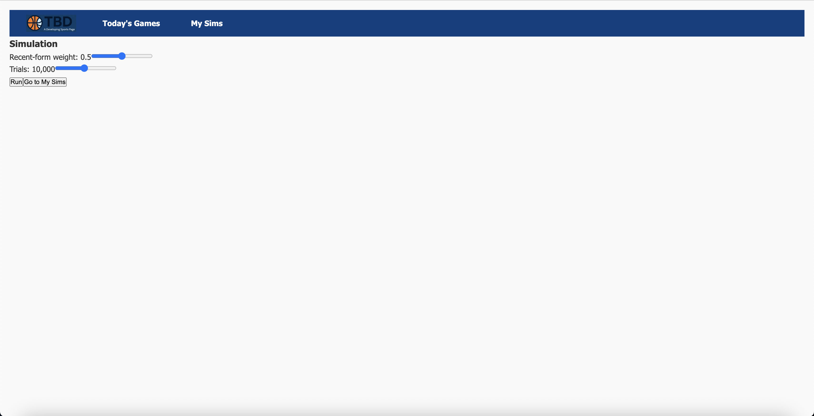
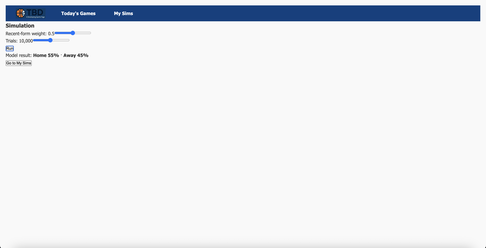

# TBD – A Developing Sports Page -- Iteration 1 Frontend

React single-page app that lets users browse games, run Monte-Carlo simulations,  
and view a personal watch-list.

## 3rd Party Libraries Used

| Library              | Why it’s included (Iteration 1 requirement)                                                                                         |
| -------------------- | ----------------------------------------------------------------------------------------------------------------------------------- |
| **react-router-dom** | Provides the three required client-side routes (`/`, `/game/:id`, `/my-sims`).                                                      |
| **axios**            | Promise-based HTTP client; wrapped in `src/services/sims.js` for clean API calls.                                                   |
| **react-bootstrap**  | React components for Bootstrap; we use **Offcanvas** for the filter drawer (counts as the “Bootstrap component not shown in demo”). |
| **bootstrap**        | Core CSS—imported once in `src/index.js` to style React-Bootstrap components.                                                       |

## Live site

`https://tbd-a-developing-sports-page.uc.r.appspot.com/`

> The app calls the API at  
> `https://tbd-a-dev-sports-page-backend.uc.r.appspot.com`.

## Pages & Routes

| Route | Purpose |
|-------|---------|
| `/` | List today’s games, Offcanvas filter (sport) |
| `/game/:id` | Slider params → **Run Simulation** |
| `/my-sims` | Saved simulations (watch-list) |

## Iteration 1 Checklist:

- Three routes with React Router
- Create + Read operations (simulate & list)
- Offcanvas (Bootstrap) fulfils UI-component requirement
- Deployed to Google Cloud alongside backend

# Iteration 1 Screenshots

## Screenshot of Homepage

## Screenshot of "Today's Games" Tab

## Screenshot of "Today's Games" Tab with Filter Dropdown

## Screenshot of "Today's Games" Tab Filtered by Sport

## Screenshot of Clicking into 'Run Simulation'

## Screenshot of Actually Running the Simulation

## Screenshot of "My Sims" Tab

