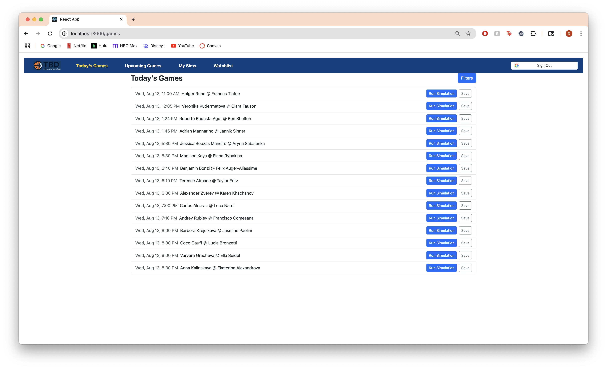
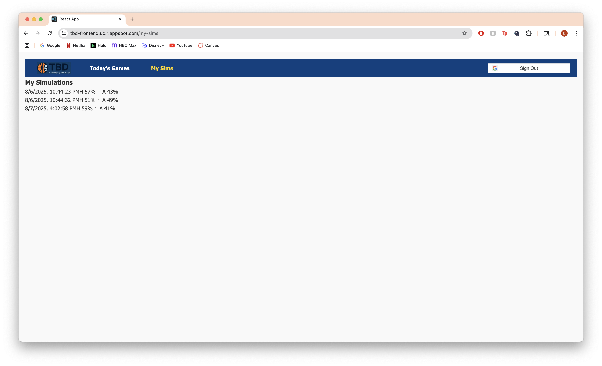

# TBD – A Developing Sports Page -- Iteration 3 Frontend

React app with Google sign-in, live game browsing, Monte-Carlo simulation runs, **Watchlist** (save games or specific simulations), and a polished **Home** experience.

### What’s new in Iteration 3
- **Watchlist tab (auth-only)**  
  - **Save** from **Today/Upcoming** → game-only save.  
  - **Save** from **My Sims** → per-simulation save (stores the sim’s result).  
  - Remove via Watchlist or toggle “Saved” back to “Save” where you added it.
  - Ready for drag-and-drop ordering (backend supports `order`).
- **Homepage enhancements**
  - **Hero** & primary CTAs (Run a Sim / Today / Upcoming / My Sims).
  - **Live Now** ticker with **StatusBadge** and “scores updated Xm ago”.
  - **How it works** card + “Learn more” modal.
  - **Starting soon** rail (next 10 by `startTime`).
- **Shared watchlist hook**: `useWatchlist()` centralizes the Saved/Saved toggle logic.
- **StatusBadge component** reused across pages for consistent “Live/Final/Scheduled”.

## Pages & Navigation

Routes:
- `/` — Home (hero, live ticker, starting soon)
- `/games` — Today’s Games (filters drawer)
- `/games/upcoming` — Upcoming Games
- `/game/:id` — Simulation setup & on-page results
- `/my-sims` — Saved simulations (drag-and-drop, delete, per-sim Save toggle)
- `/watchlist` — Saved games & per-sim rows (remove or navigate to Run)

## Key Components & Hooks

- `components/StatusBadge.js`  
  Small component displaying **Live / Final / Scheduled** consistently.

- `components/DnDCard.js`  
  Simple drag-and-drop wrapper; renders `{children}` inside, shows a numbered badge, and calls `moveCard(dragIndex, hoverIndex)`.

- `hooks/useWatchlist.js`  
  Central store + actions:
  ```js
  const {
    loading, error, refresh,
    isSavedGame, toggleGame, addGame, removeGame,
    isSavedSim,  toggleSim,  addSim,  removeSim
  } = useWatchlist();
  ```
  - **Game save** buttons use `isSavedGame` / `toggleGame`.
  - **Simulation save** buttons use `isSavedSim` / `toggleSim`.

## UX Behaviors

- **Run Simulation** (on `/game/:id`)  
  Immediately shows the result on the page **and** the backend persists it.

- **My Sims**  
  Drag-and-drop reordering; Delete button removes a sim server-side and updates the list.  
  Per-sim **Save** button toggles watchlist rows that reference that exact simulation.

- **MatchList & Home rails**  
  **Save** toggles at the game level (`isSavedGame` / `toggleGame`).

- **Watchlist**  
  Lists both game-only rows and per-sim rows (joined with `game` via backend).  
  Includes **Run Simulation** button per item and **Remove** (game-only) or **Remove** per-sim.

## Odds & Live Data on the Frontend

- **Live Now** uses game status and (optionally) `lastScoreUpdate` to render a freshness chip (“scores updated 2m ago”).
- The **StatusBadge** abstracts “Live / Final / Scheduled” so all pages show consistent badges.
- Auto-refresh strategy on Today’s Games: a 30s interval that pauses when the tab is hidden to reduce requests.

---

## Iteration History

### Iteration 1 (recap)
- 3 routes (Home / Game / My Sims), Offcanvas filters, simple create/read simulations
- Deployed to App Engine, Axios calls to `/api`

### Iteration 2 (recap)
- **Google OAuth 2** with `@react-oauth/google`
- Shared **Axios client** with auth header
- Removed demo user; all calls use logged-in Google identity
- Deployed FE/BE with production configs

### Iteration 3 (this doc)
- **Watchlist** (game-only + per-sim saves) with removal and deterministic ordering
- **Saved Sims** deterministic order + DnD persist
- **Homepage** enhancements (Live ticker, How it works, Starting soon)
- **Cron** fixed to **GROC** schedules
- **Seeding** for local DB

# Iteration 3 Screenshots

## Screenshot of new homepage


## Screenshot of Today's Games (own tab in Navbar)



## Screenshot of Upcoming Games tab


## Screenshot of Upcoming Games tab with a sport filter


## Screenshot of running a simulation in the new UI


## Screenshot of running the same game's simulation but with different weights and number of trials


## Screenshot of My Sims page with drag & drop cards


## Screenshot of first card in My Sims page having been dragged to third place


## Screenshot of the same card (now in third) un-saved (by clicking on 'Saved')


## Screenshot of the same card now deleted from My Sims


## Screenshot of new Watchlist page


## Screenshot of saved simulation we ran earlier showing in our watchlist along with its simulation results


------------------------------------------------------------------------------------------------------------------------------------------------------------------
------------------------------------------------------------------------------------------------------------------------------------------------------------------
------------------------------------------------------------------------------------------------------------------------------------------------------------------

# TBD – A Developing Sports Page -- Iteration 2 Frontend

- **Integrated Google OAuth2** via `@react-oauth/google`  
  - Added `Login` & `Logout` components  
  - Stored the ID token in `localStorage` and React state  
- **Created a shared Axios client** (`src/services/client.js`)  
  - Automatically prefixes all requests with `/api` and injects the Bearer token  
- **Removed hard-coded “demo” userId**  
  - Pages now use the logged-in user’s `googleId` from the token  
- **Updated service calls** in all pages (Home, MatchList, SimulationSetup, SavedSimulations)  
  - Swapped direct `axios` to calls through `client.get` / `client.post`  
- **Conditional routing/UI** based on auth state  
  - Navigation bar now shows “Sign in” or “Log out” button appropriately  
- **Styling tweaks**  
  - Built a custom Logout button in `Logout.css` to match the GoogleLogin look  
- **Deployed** the fully integrated frontend to Google App Engine  

**Live site:** https://tbd-frontend.uc.r.appspot.com

# Iteration 2 Screenshots

## Screenshot of Google Sign In prompt as soon as visiting page


## Screenshot of Google Sign Out box


## Screenshot of Google Sign In box after signing out


## Screenshot of "My Sims" Tab with enhanced simulations
## (It used to show hardcoded probabilities of 55%/45%, no matter the form or number of simulations selected)



------------------------------------------------------------------------------------------------------------------------------------------------------------------
------------------------------------------------------------------------------------------------------------------------------------------------------------------
------------------------------------------------------------------------------------------------------------------------------------------------------------------

# TBD – A Developing Sports Page -- Iteration 1 Frontend

React single-page app that lets users browse games, run Monte-Carlo simulations,  
and view a personal watch-list.

## 3rd Party Libraries Used

| Library              | Why it’s included (Iteration 1 requirement)                                                                                         |
| -------------------- | ----------------------------------------------------------------------------------------------------------------------------------- |
| **react-router-dom** | Provides the three required client-side routes (`/`, `/game/:id`, `/my-sims`).                                                      |
| **axios**            | Promise-based HTTP client; wrapped in `src/services/sims.js` for clean API calls.                                                   |
| **react-bootstrap**  | React components for Bootstrap; we use **Offcanvas** for the filter drawer (counts as the “Bootstrap component not shown in demo”). |
| **bootstrap**        | Core CSS—imported once in `src/index.js` to style React-Bootstrap components.                                                       |

## Live site

`https://tbd-frontend.uc.r.appspot.com`

> The app calls the API at  
> `https://tbd-backend.uc.r.appspot.com`.

## Pages & Routes

| Route | Purpose |
|-------|---------|
| `/` | List today’s games, Offcanvas filter (sport) |
| `/game/:id` | Slider params → **Run Simulation** |
| `/my-sims` | Saved simulations (watch-list) |

## Iteration 1 Checklist:

- Three routes with React Router
- Create + Read operations (simulate & list)
- Offcanvas (Bootstrap) fulfils UI-component requirement
- Deployed to Google Cloud alongside backend

# Iteration 1 Screenshots

## Screenshot of Homepage


## Screenshot of "Today's Games" Tab


## Screenshot of "Today's Games" Tab with Filter Dropdown


## Screenshot of "Today's Games" Tab Filtered by Sport


## Screenshot of Clicking into 'Run Simulation'


## Screenshot of Actually Running the Simulation


## Screenshot of "My Sims" Tab

